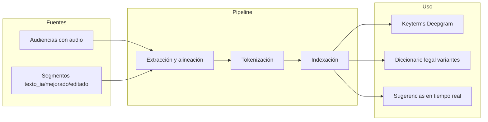

# Revisión JudiScribe: mínimos errores, corrección sin añadir palabras y modelo que aprende

## 1. Situación actual (resumen)

- **Flujo**: Cliente envía audio → WebSocket backend → Deepgram Nova-3 (streaming) → consolidación de segmentos por speaker → Claude (completitud + mejora de segmento) → diccionario jurídico (fuzzy) → frontend (Canvas TipTap).
- **Datos disponibles para aprendizaje**: `Audiencia.audio_path`, `Segmento.texto_ia`, `Segmento.texto_mejorado`, `Segmento.texto_editado`, `Segmento.editado_por_usuario`, `Segmento.palabras_json` (palabras con confianza y alternativas).
- **Problema explícito**: no quieres que el sistema **aumente palabras**; solo corregir/sustituir (como corrección en editores de código), no completar frases insertando texto nuevo.

---

## 2. Revisión completa y reducción del margen de error

### 2.1 Puntos de error actuales

| Origen                | Riesgo                                            | Acción recomendada                                                                                                                            |
| --------------------- | ------------------------------------------------- | --------------------------------------------------------------------------------------------------------------------------------------------- |
| **Deepgram**          | Errores en términos jurídicos, acentos, homófonos | Keyterms ya usados (100); ampliar con corpus aprendido (ver §4). Revisar `utterance_end_ms` / `endpointing` para no cortar frases.            |
| **Consolidación**     | Cortar antes de frase completa o unir dos frases  | Ya usas Claude para completitud; reforzar reglas y umbrales (ej. no procesar < 5 palabras salvo respuesta corta).                             |
| **Claude (mejora)**   | Inventar o completar texto (añadir palabras)      | **Regla estricta en prompt**: "NUNCA añadir palabras; solo puntuación, mayúsculas y sustitución de palabra por corrección ortográfica/legal". |
| **Diccionario legal** | Falsos positivos (corregir palabra correcta)      | Umbral de confianza (ej. solo sugerir si confidence > 0.75); excluir palabras ya en `legal_terms` correctas.                                  |
| **Frontend**          | InlineSuggestion inserta texto (aumenta palabras) | Desacoplar: **solo** sugerencias de **reemplazo** de palabra actual (1:1), no continuación; ver §3.                                           |

### 2.2 Mejoras concretas de precisión

- **Umbrales de confianza**: En [deepgram_streaming.py](judiscribe/backend/app/services/deepgram_streaming.py), palabras con `confidence < 0.85` ya generan alternativas; usar ese mismo umbral en UI para mostrar “reemplazo sugerido” solo en palabras de baja confianza.
- **Segundo paso opcional (batch)**: Cuando exista `batch_process_audio` (faster-whisper + Pyannote), ofrecer “Reprocesar con Whisper” para audiencias ya grabadas y fusionar/validar contra segmentos streaming (sin sobrescribir lo marcado `editado_por_usuario`).
- **Regla absoluta en mejoramiento**: En [real_time_enhancement.py](judiscribe/backend/app/services/real_time_enhancement.py), en `_build_enhancement_prompt`, añadir y priorizar: **“NUNCA añadir palabras ni completar frases. Solo: puntuación, mayúsculas, y reemplazo de palabra mal transcrita por la forma correcta (1 palabra → 1 palabra).”**
- **Análisis de frase**: En [context_analysis.py](judiscribe/backend/app/services/context_analysis.py), en `get_phrase_corrections`, quitar “Frases incompletas que puedas completar del contexto” y sustituir por: “Solo corregir palabras existentes (ortografía, tildes, términos legales); no añadir ni completar texto.”

---

## 3. Autocompletado tipo editor: solo corrección (no añadir palabras)

Objetivo: comportamiento tipo “sugerencia de corrección” en editor de código (reemplazar token bajo cursor), **sin** insertar texto nuevo.

### 3.1 Comportamiento deseado

- **Al seleccionar una palabra (o tener cursor en una palabra)**  
Mostrar sugerencias de **reemplazo** (1:1): diccionario legal, alternativas Deepgram, y/o IA contextual. Al aceptar: reemplazar esa palabra por la elegida (no insertar después).
- **No** mostrar “ghost text” que complete la frase (eso añade palabras).

### 3.2 Cambios en frontend y backend

- **InlineSuggestion (ghost text)**:  
  - **Opción A (recomendada)**: Desactivar o eliminar la extensión InlineSuggestion para “completar frase”, para no añadir palabras.  
  - **Opción B**: Reutilizarla solo para “sustitución”: que la sugerencia sea **una sola palabra** que reemplace la palabra bajo el cursor (no `insertText` después del cursor, sino reemplazar rango de la palabra actual). Así el conteo de palabras no aumenta.
- **WordCorrectionPopover** y **SuggestionPopover**:  
Ya hacen reemplazo (palabra original → palabra sugerida). Mantener y priorizar: atajo rápido (ej. Tab para aceptar primera sugerencia, 1–5 para elegir), y que las sugerencias provengan de: (1) diccionario legal, (2) alternativas Deepgram, (3) análisis contextual (Claude) con la regla “solo sugerir reemplazos, nunca añadir”.
- **API de predicción**:  
El endpoint `/prediction/suggest` actual devuelve `suggestion` como continuación de frase (usado por InlineSuggestion). Si se mantiene InlineSuggestion solo para reemplazo, ese endpoint debería poder usarse para “sugerencia de reemplazo para la palabra actual” (contexto = frase actual + palabra seleccionada) devolviendo **una palabra** (o lista de candidatos) y no una frase a insertar.

Resumen: **no aumentar palabras** = no insertar texto después del cursor; solo reemplazar la palabra/segmento actual por una corrección.

---

## 4. Corpus, tokenización e indexación para que el sistema “aprenda”

Objetivo: usar los audios y textos de todos los transcriptores para mejorar transcripción y sugerencias, con procesamiento, tokenización e indexación reutilizables.

### 4.1 Fuentes de datos

- **Audiencia**: `audio_path` (WAV), `audio_duration_seconds`.  
- **Segmentos**: `texto_ia`, `texto_mejorado`, `texto_editado`, `editado_por_usuario`, `palabras_json` (palabras con timestamps y alternativas).  
- Criterio de “verdad de referencia”: preferir `texto_editado` si `editado_por_usuario`; si no, `texto_mejorado`; si no, `texto_ia`.

### 4.2 Pipeline propuesto (corpus → tokenización → indexación)

- **Extracción**:  
  - Por audiencia: listar segmentos ordenados; para cada uno, texto de referencia (editado > mejorado > texto_ia).  
  - Opcional: alinear palabra-a-palabra usando `palabras_json` (timestamps) y el texto de referencia para obtener pares (transcripción_original, corrección_usuario).
- **Tokenización**:  
  - Normalizar (minúsculas para índice, conservar formas para visualización).  
  - Tokenizar por palabra (y opcionalmente n-gramas 2–3 para frases legales).  
  - Filtrar stopwords muy cortas (opcional) para el índice de términos.
- **Indexación**:  
  - **Términos frecuentes**: contar frecuencias de palabras/n-gramas en el corpus; los más frecuentes que no estén ya en keyterms → candidatos a enviar a Deepgram (límite 100).  
  - **Pares (error → correcto)**: de segmentos con `editado_por_usuario` o diferencias texto_ia vs texto_mejorado/editado, extraer sustituciones palabra-a-palabra (con algo tipo diff o alineación); alimentar `legal_terms.json` (variantes_error → correcto) o un índice separado para sugerencias.  
  - **Por usuario (opcional)**: mismo pipeline por `created_by` para mejorar sugerencias por transcriptor.

### 4.3 Implementación sugerida (backend)

- **Nuevo módulo** (ej. `app/services/corpus/`):  
  - `extract.py`: lee audiencias/segmentos, produce “documentos” (texto de referencia por segmento, y opcionalmente pares error→correcto).  
  - `tokenize.py`: normalización + tokenización (y n-gramas si aplica).  
  - `index.py`: construye estructuras en memoria o en DB/Redis (frecuencias, pares error→correcto).
- **Tarea Celery** (ej. `tasks/build_corpus.py`): “Construir corpus” (ej. noche; o tras N audiencias nuevas): ejecuta extracción → tokenización → indexación y actualiza:  
  - Lista de keyterms para Deepgram (y/o archivo o tabla config).  
  - `legal_terms.json` o tabla de variantes (variantes_error nuevas desde pares aprendidos).
- **Privacidad y consentimiento**: usar solo audiencias/segmentos que el sistema esté autorizado a usar para “mejora del servicio” (configuración o política clara; anonimización si se requiere).

### 4.4 Modelo que “aprende”

- **No implica obligatoriamente** un modelo de red neuronal entrenado desde cero.  
- **Fase 1 (recomendada)**: el “aprendizaje” es vía corpus + tokenización + indexación:  
  - Mejorar **keyterms** Deepgram (menos errores en términos frecuentes).  
  - Ampliar **diccionario legal** con variantes observadas (error → correcto).  
  - Sugerencias en tiempo real desde el índice (reemplazo 1:1).
- **Fase 2 (opcional)**: si más adelante se quiere un modelo que prediga correcciones:  
  - Entrenar un modelo pequeño (ej. clasificador o seq2seq) con pares (contexto, palabra_actual) → palabra_corregida, usando el corpus generado.  
  - O usar un LM pequeño fine-tuneado solo para “dado contexto + palabra, devolver reemplazo” (sin generar texto extra), para no añadir palabras.

---

## 5. Resumen de tareas recomendadas

1. **Reglas “no añadir palabras”**
  - [real_time_enhancement.py](judiscribe/backend/app/services/real_time_enhancement.py): prompt explícito: solo puntuación, mayúsculas, reemplazo 1:1.  
  - [context_analysis.py](judiscribe/backend/app/services/context_analysis.py): en corrección de frase, solo corregir palabras existentes; quitar “completar frases”.
2. **Autocompletado = solo corrección**
  - Decidir: desactivar InlineSuggestion de “completar frase” o reconvertirla a “reemplazo de palabra bajo cursor” (sin insertar texto nuevo).  
  - Asegurar que WordCorrectionPopover y SuggestionPopover sean el flujo principal de sugerencias (reemplazo 1:1).  
  - Si se mantiene un endpoint de “sugerencia”, añadir modo “reemplazo para palabra actual” (una palabra o N candidatos) y no “continuación de frase”.
3. **Revisión de precisión**
  - Revisar umbrales de confianza (ej. 0.85) en flujo Deepgram → sugerencias.  
  - Documentar y, si aplica, ajustar `utterance_end_ms` / `endpointing` para reducir cortes de frase.
4. **Corpus + tokenización + indexación**
  - Implementar extracción desde `Audiencia`/`Segmento`.  
  - Tokenización (palabras + opcional n-gramas) y indexación (frecuencias, pares error→correcto).  
  - Integrar con keyterms Deepgram y con `legal_terms.json` (o equivalente).  
  - Tarea periódica (Celery) para actualizar keyterms y variantes desde el corpus.
5. **Política de uso de datos**
  - Definir qué audiencias/segmentos se usan para corpus y bajo qué consentimiento/configuración.

---

## 6. Orden sugerido de implementación

- **Corto plazo**: (1) y (2) — reglas “no añadir palabras” y autocompletado solo como corrección.  
- **Medio plazo**: (3) revisión de precisión y (4) pipeline de corpus (extracción, tokenización, indexación) e integración con keyterms y diccionario.  
- **Opcional después**: segundo paso batch (Whisper), modelo de reemplazo aprendido (Fase 2).

Este plan mantiene el control en el transcriptor, minimiza errores por “invención” de texto, alinea el sistema con “corregir sin añadir palabras” y sienta las bases para que el sistema mejore con el uso de todos los transcriptores mediante corpus, tokenización e indexación.